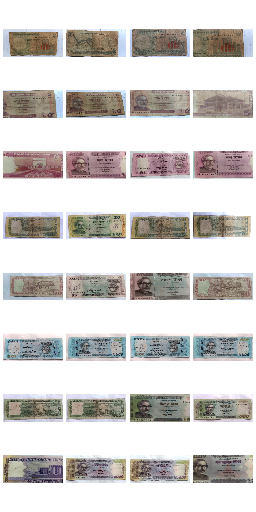
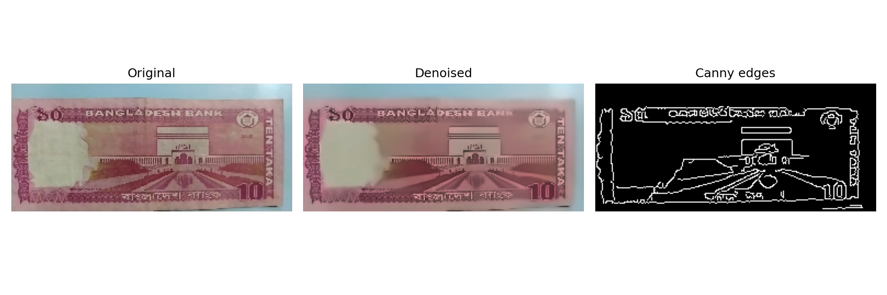
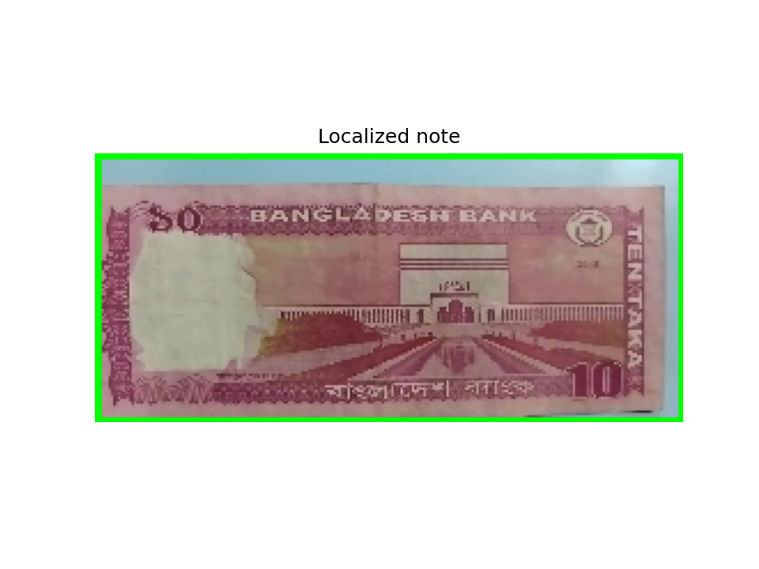
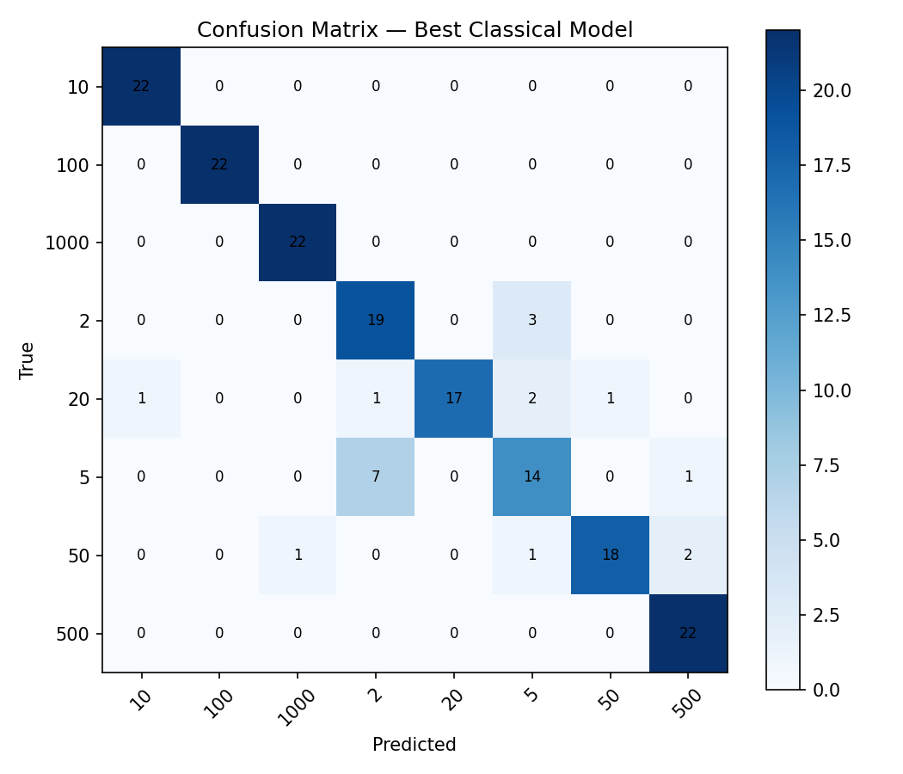
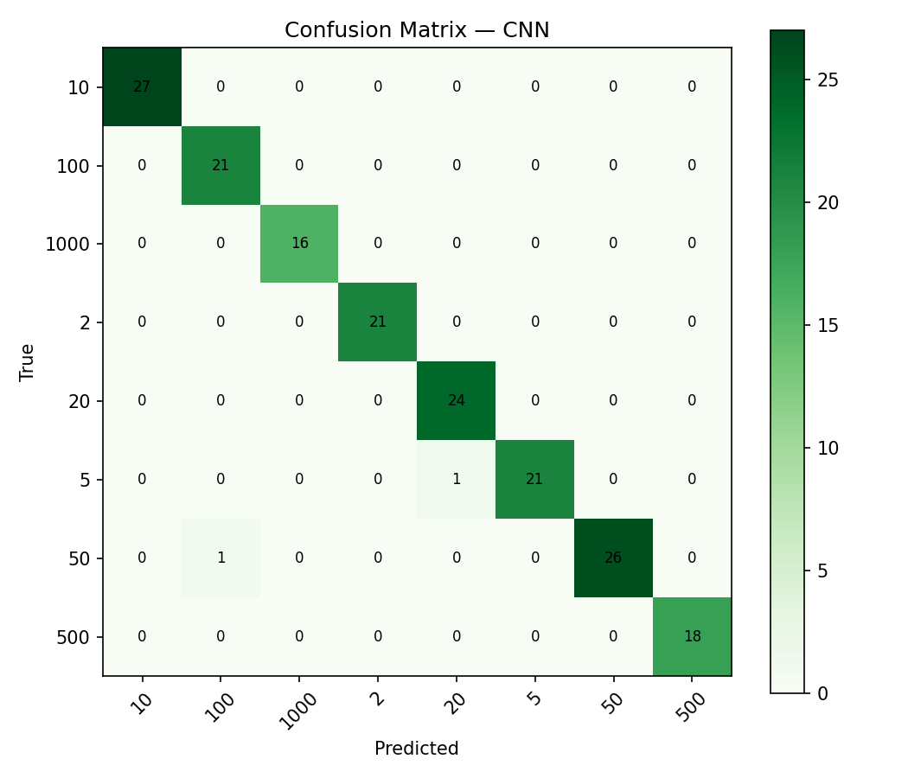
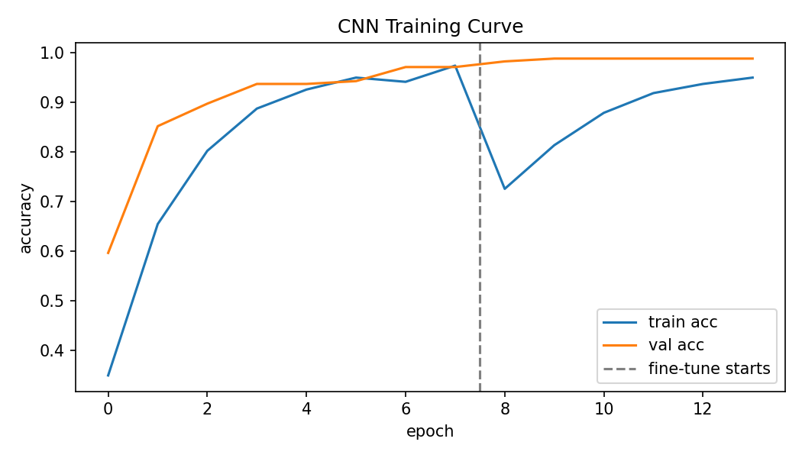
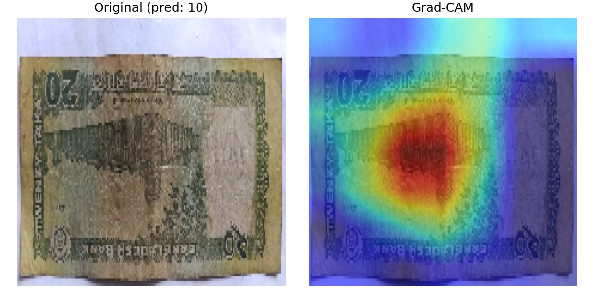

# 🇧🇩 Bangladeshi Banknote Recognition

A computer vision and machine learning project for recognizing Bangladeshi banknote denominations from images.

## 📌 Project Overview

This project implements a complete banknote recognition pipeline, starting from image preprocessing and banknote localization to feature extraction, machine learning, deep learning, and model visualization.

The project explores both **traditional image processing and machine learning techniques** as well as a **MobileNetV2-based CNN** approach.

## 🔄 Project Pipeline

**Input Image → Preprocessing → Banknote Localization → Feature Extraction → Classification → Evaluation → Grad-CAM**

## 🛠️ Techniques Used

### Image Processing

* Non-Local Means Denoising
* Grayscale Conversion
* Gaussian Blur
* Canny Edge Detection
* Otsu Thresholding
* Contour Detection
* Banknote Localization and Cropping

### Feature Extraction

* Histogram of Oriented Gradients (HOG)
* Color Histogram

### Machine Learning

* Support Vector Machine (SVM)
* Random Forest

### Deep Learning

* MobileNetV2
* Transfer Learning
* Grad-CAM

## 📊 Project Visualizations

### Sample Dataset

### Image Preprocessing

### Banknote Localization

### Classical Machine Learning

### CNN Classification

### CNN Training

### Grad-CAM Visualization

## 📈 Model Evaluation

The models were evaluated using standard classification metrics including:

* Accuracy
* Precision
* Recall
* F1-Score
* Confusion Matrix

The project compares traditional machine learning approaches with a MobileNetV2-based deep learning approach.

## 📂 Repository Contents

| File                                      | Description                             |
| ----------------------------------------- | --------------------------------------- |
| `Banknote_Recognition_Pipeline (1).ipynb` | Complete implementation and experiments |
| `BDBanknote_Recognition_Report.pdf`       | Detailed project report                 |
| `README.md`                               | Project documentation                   |
| `sample_grid.png`                         | Sample banknote images                  |
| `preprocessing_demo.png`                  | Image preprocessing results             |
| `localization_demo.png`                   | Banknote localization results           |
| `cm_classical.png`                        | Classical ML confusion matrix           |
| `cm_cnn.png`                              | CNN confusion matrix                    |
| `cnn_training_curve.png`                  | CNN training and validation curves      |
| `gradcam_demo.png`                        | Grad-CAM visualization                  |

## 📚 Dataset

The dataset used in this project is available on Kaggle:

[Bangladeshi Banknote Dataset](https://www.kaggle.com/datasets/rahnumatasnim1604103/bangladeshi-banknote-dataset)

The dataset is not included in this repository.

## 📄 Project Report

The complete project report is available here:

[BDBanknote_Recognition_Report.pdf](BDBanknote_Recognition_Report.pdf)

## 💻 Implementation

The complete implementation, experiments, model training, evaluation, and visualizations are available in the Jupyter Notebook:

[Banknote Recognition Pipeline](Banknote_Recognition_Pipeline%20%281%29.ipynb)

## 👨‍💻 Author

**Arefin Rahman Ronok**

Computer Science & Engineering
